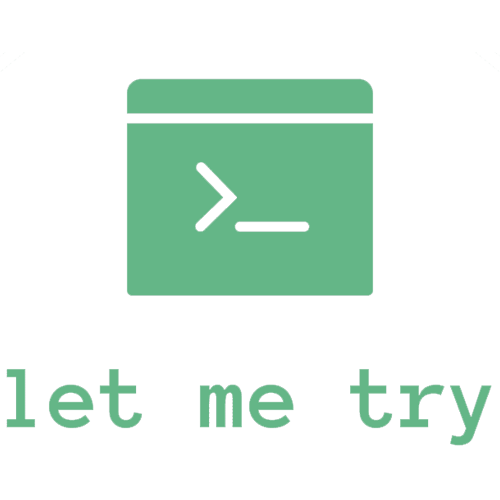

## Introduction

🤗️ 各类 C/C++ 开源库编译、安装、使用指北，让我试着向你解释这一切。

## Tutorial

|                        Repo                         |                            Watch                             |                             Fork                             |                             Star                             |                           License                            |  Let me try   |
| :-------------------------------------------------: | :----------------------------------------------------------: | :----------------------------------------------------------: | :----------------------------------------------------------: | :----------------------------------------------------------: | :-----------: |
|  [opencv/opencv](https://github.com/opencv/opencv)  |  |  |  |  | :point_right: |
|  [nlohmann/json](https://github.com/nlohmann/json)  |  |  |  |  | :point_right: |
| [USCiLab/cereal](https://github.com/USCiLab/cereal) |  |  |  |  | :point_right: |

## License

[MIT](https://opensource.org/licenses/MIT)

Copyright (c) 2022 Kanda-Mashiro
